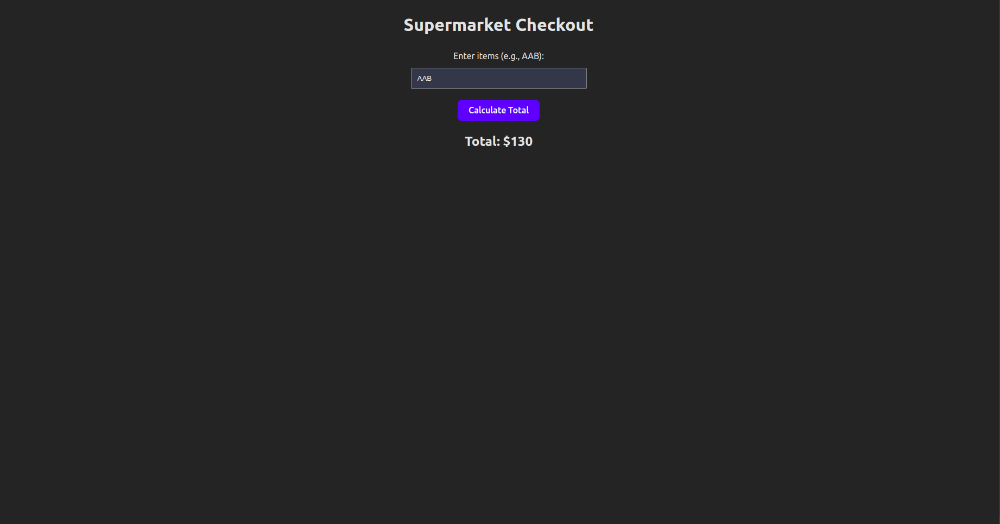
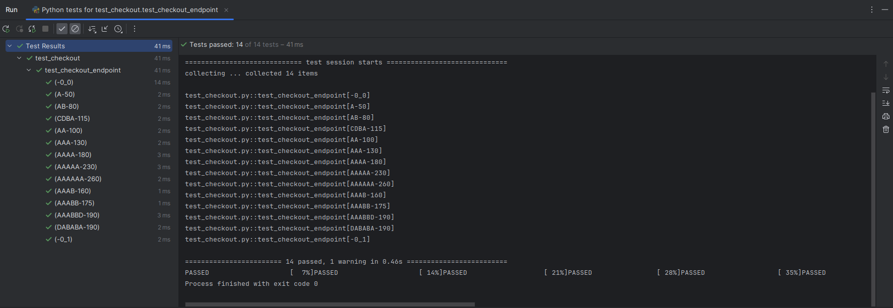

# Supermarket Checkout App

This project contains both the backend (built with FastAPI) and the frontend (built with Vite and React) for a simple supermarket checkout application.



## Requirements

Implement the code for a supermarket checkout process that calculates the total price of items added to the cart by the customer. Products can be purchased at their individual pricing or at a discounted price when purchased in groups as listed below:

- Item 'A': $50 individually, or $130 for 3 items.
- Item 'B': $30 individually, or $45 for 2 items.
- Item 'C': $20 individually.
- Item 'D': $15 individually.

The checkout system should accept items in any order and recognize special pricing to calculate the total order pricing correctly.

## Project Structure
The project structure is as follows:

* `backend/`: Contains the FastAPI backend code.
* `frontend/`: Contains the Vite and React frontend code.
* `README.md`: Instructions and details for running the project.
* `docker-compose.yml`: Docker Compose configuration to run both the frontend and backend services together.

## How to Run

1. Install Docker and Docker Compose if you haven't already.

2. Clone this repository:

```bash
git clone https://github.com/your-username/CheckoutApp.git
cd CheckoutApp
```

3. Build and run the Docker containers using Docker Compose:
```bash
docker compose up --build
```
This command will build the Docker images for both the frontend and backend, and then start the containers. The backend will be accessible at http://localhost:8000, and the frontend will be accessible at http://localhost:5173.

4. To stop the containers, press Ctrl + C in the terminal where docker-compose up is running, and then run:
```bash
docker compose down
```

## How to Test the Backend
To ensure our checkout system works as expected, we have written tests that can be run to validate the logic. Follow these steps to run the tests:

1. Ensure you have Python installed on your system.
2. Navigate to the `backend/` directory:
    ```bash
    cd backend/
    ```
3. Install the required Python dependencies. It is recommended to use a virtual environment:
    ```bash
    python -m venv env
    source env/bin/activate
    pip install -r requirements.txt
    ```
4. Run the tests using pytest:
    ```basch
    pytest
    ```

5. If you wish to see a coverage report, you can install pytest-cov and then run pytest with the coverage option:

    ```bash
    pip install pytest-cov
    pytest --cov=.
    ```
This will display a report in the terminal showing which parts of your code are covered by tests.

